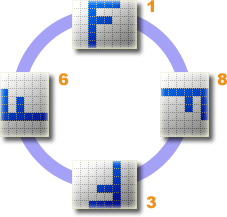

.. ==================================================
.. FOR YOUR INFORMATION
.. --------------------------------------------------
.. -*- coding: utf-8 -*- with BOM.

.. include:: ../../Includes.txt
.. include:: Images.txt

Options
-------

General options are configured with the first tab of the configuration panel:

|general_options|

Automatic orientation
^^^^^^^^^^^^^^^^^^^^^

If this checkbox is ticked, TYPO3 will try to automatically rotate the picture. Many newer digital cameras (both dSLR and Point & Shoot digicams) have a built-in orientation sensor. Virtually all Canon and Nikon digital cameras have an orientation sensor. The output of this sensor is used to set the EXIF orientation flag in the image file's metadata to reflect the positioning of the camera with respect to the ground. Canon calls their sensor the “Intelligent Orientation” sensor. It is presumably a 2-axis tilt sensor, allowing 4 possible orientations to be detected (shown in the diagram below):

	Description and diagram adapted from http://www.impulseadventure.com/photo/exif-orientation.html

Keep profile and metadata
^^^^^^^^^^^^^^^^^^^^^^^^^

Normally color profile and metadata information such as EXIF, IPTC and XMP are removed from the picture during the resize process. This option lets you keep them. Example of such information is shown below:

|metadata|

Resize PNG files with alpha channel
^^^^^^^^^^^^^^^^^^^^^^^^^^^^^^^^^^^

By default PNG files which contain an alpha channel or a transparent color will not be resized because they are very likely to loose their transparency. If ticked, this checkbox will force all PNG files to be resized (if they meet the conditions of course).

Image type conversion mapping
^^^^^^^^^^^^^^^^^^^^^^^^^^^^^

The mapping lets you automatically convert images from one format to another one during the resize processing. This is typically useful to convert non-Web formats (e.g., bmp and tif/tiff) to jpg or png.
