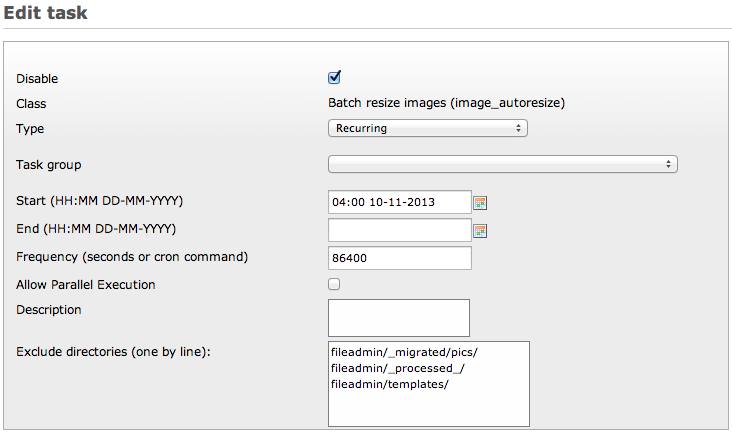

.. ==================================================
.. FOR YOUR INFORMATION
.. --------------------------------------------------
.. -*- coding: utf-8 -*- with BOM.

.. include:: ../../Includes.txt

.. _batch-processing:

Batch processing images
-----------------------

This extension provides a scheduler task to batch process uploaded images in the directories you normally watch for
image upload (see :ref:`general-settings`).

It is particularly useful if you let users upload images outside of TYPO3 (e.g., using FTP), thus bypassing upload
post-processing to automatically resize them according to your rule sets (see figure :ref:`myfigure`).

.. _myfigure:

	Configuration form of a scheduler task to batch resize images

.. important::
	As the scheduler task will process each directory found in your rule sets, make sure to exclude directories you
	normally do not show to your editors (e.g., :file:`fileadmin/templates`) which may contain large image assets that
	should never be processed by this extension.
