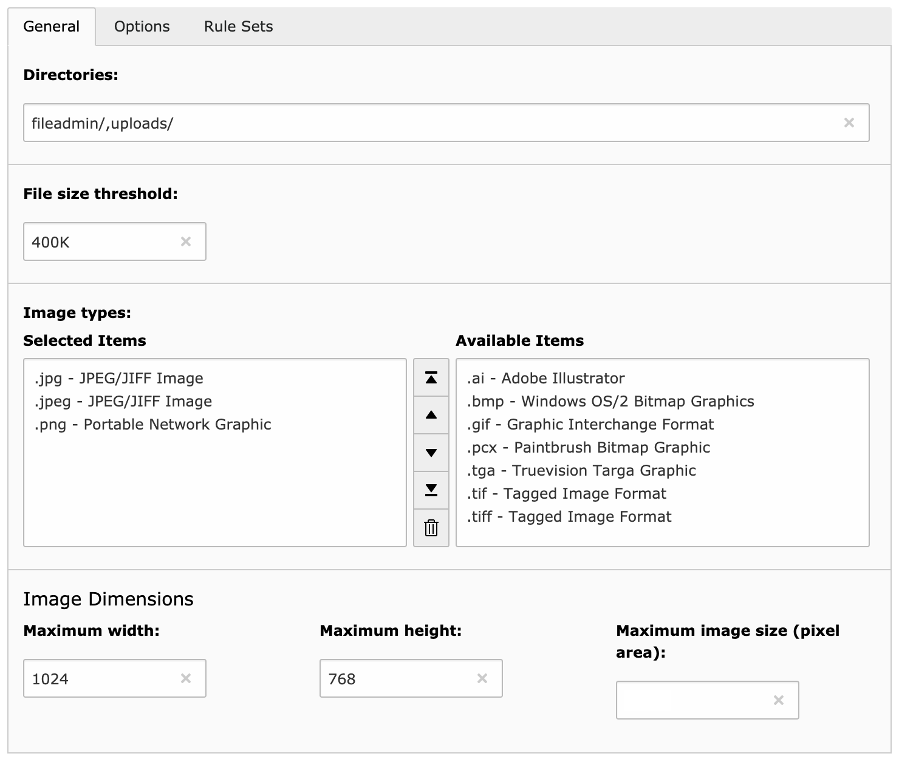

.. ==================================================
.. FOR YOUR INFORMATION
.. --------------------------------------------------
.. -*- coding: utf-8 -*- with BOM.

.. include:: ../../Includes.txt

.. _general-settings:

General settings
----------------

General settings are configured with the first tab of the configuration panel:

.. _general-settings-directories:

Directories
^^^^^^^^^^^

This is a comma-separated list of directories that should be monitored for image uploads. This includes any subdirectory
of them too. In the example above, both :file:`fileadmin/` and :file:`uploads/` will be monitored.

You may use two different wildcards characters:

- The single asterisk (``*``) searches for a single directory. E.g., :file:`fileadmin/*/images/` will
  match :file:`fileadmin/directory1/images/` and :file:`fileadmin/directory2/images/` but
  not :file:`fileadmin/directory3/subdirectory/images/`.

- The double asterisk (``**``) searches for any number of subdirectories. E.g., :file:`fileadmin/**/images/` will match
  any subdirectory :file:`images` within :file:`fileadmin`, and of course any sub-subdirectory of it too.

.. _general-settings-size-threshold:

Size threshold
^^^^^^^^^^^^^^

Only original pictures bigger than this value will be processed. The field accepts suffices "B" for bytes, "K" for KB
and "M" for MB. The number itself is interpreted as an integer.

.. _general-settings-image-types:

Image types
^^^^^^^^^^^

This is the list of image formats that should be processed, if both the directory and the size threshold match. The
actual list of available types is read from ``$TYPO3_CONF_VARS['GFX']['imagefile_ext']``.

.. important::
	PDF type is always removed from this list, whenever it is available, as it usually is not considered being an image
	even if it can be processed by TYPO3 as such (to extract preview of the cover page for instance).

.. _general-settings-maximum-wh:

Maximum width / height
^^^^^^^^^^^^^^^^^^^^^^

These are the maximum dimensions in pixels a picture will be bound to after the resize processing. Aspect ratio will of
course be preserved.
