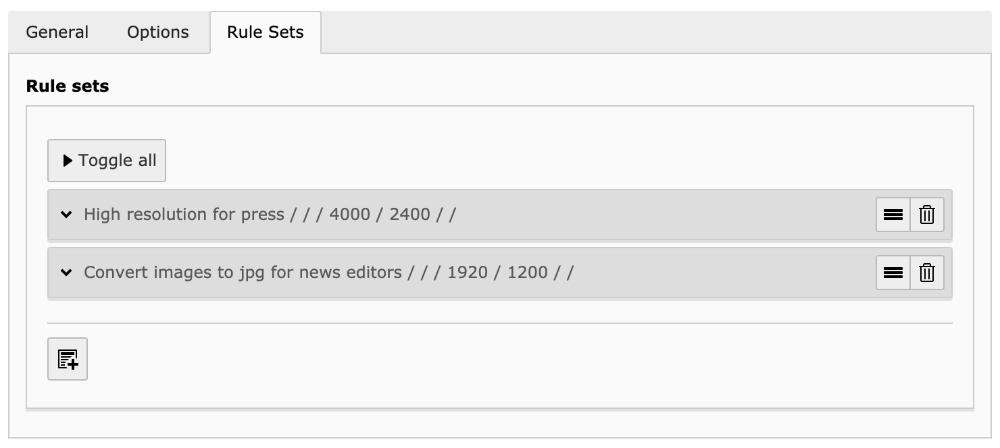
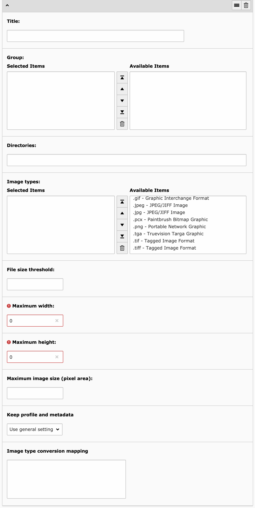

.. ==================================================
.. FOR YOUR INFORMATION
.. --------------------------------------------------
.. -*- coding: utf-8 -*- with BOM.

.. include:: ../../Includes.txt

.. _rule-sets:

Rule sets
---------

Rule sets are managed with the third tab of the configuration panel:

They basically are a set of options that should override the general settings under certain circumstances. The picture
above shows two rules:

- Allow higher resolution pictures if they are targeted at the press (e.g., allow pictures to be as wide as 4000px).
  This may either be group-related (user of group "Press and Communication" are allowed to upload such big pictures)
  and/or directory-related (photos uploaded in a special :file:`press/` directory are allowed to be that large).

- Convert all images to jpg for news editors. You may define that members of a group "News Editors" have all their
  pictures converted to jpg, whatever the original format was.

The following picture shows how a rule set is configured:

The parameters are identical to those for the general settings. The mechanism is easy to understand:

- Rule sets are tested in the order of their definition. You may reorder them by drag-and-drop. First rule set that
  matches will be used. If no rule set matches, general settings will be taken into account, if they matches!

- Settings in the rule set which are left empty or undefined (groups) will inherit the corresponding value from general
  settings.

.. important::
	When :ref:`batch processing <batch-processing>` images, rule sets restricted to a given list of user groups will
	match but will not actually trigger the resize of the image since the user group cannot be determined anymore after
	a file has been uploaded.
