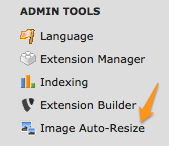

.. ==================================================
.. FOR YOUR INFORMATION
.. --------------------------------------------------
.. -*- coding: utf-8 -*- with BOM.

.. include:: ../../Includes.txt

.. _install:

Installing the extension
------------------------

Install this extension as usual with Extension Manager.

TYPO3 6.2 LTS
^^^^^^^^^^^^^

You may configure this extension as usual, using the configuration icon within Extension Manager:

.. figure:: ../../Images/extension-manager-configuration.png
	:alt: Configuration within Extension Manager
	:width: 711

TYPO3 4.5 to 6.1
^^^^^^^^^^^^^^^^

The whole configuration is made from the Admin Tools Backend module "Image Auto-Resize":

