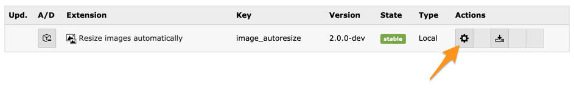

.. ==================================================
.. FOR YOUR INFORMATION
.. --------------------------------------------------
.. -*- coding: utf-8 -*- with BOM.

.. include:: ../../Includes.txt

.. _install:

Installing the extension
------------------------

Install this extension as usual with Extension Manager.

You may configure this extension as usual, using the configuration icon within Extension Manager:

