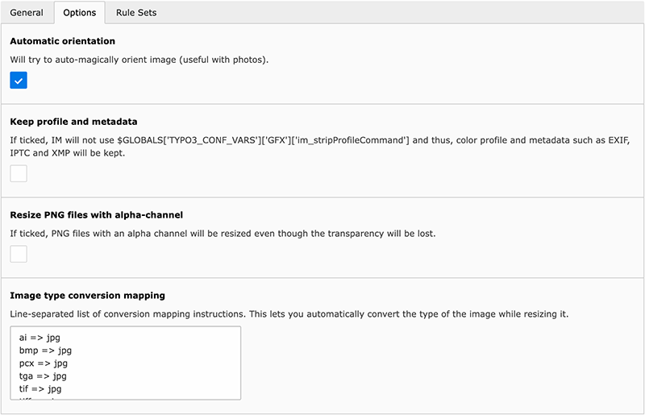

.. ==================================================
.. FOR YOUR INFORMATION
.. --------------------------------------------------
.. -*- coding: utf-8 -*- with BOM.

.. include:: ../Includes.txt

.. _introduction:

Introduction
============

.. _what-it-does:

What does it do?
----------------

This extension automatically resizes images to a given maximum height/width or total image size right after they have
been uploaded to the TYPO3 website. The aspect ratio is of course kept.

The idea behind this extension is that TYPO3 should make both administrators and editors happy. Administrators want the
website's footprint on server as small as possible to be able to handle backups efficiently and want the web server to
deliver the pages as quick as possible. On the other hand, editors should be able to do their job and not bother with
technical considerations such as the size of a picture on disk or that uploading their wonderful sunset taken during
holidays with their 12 MP camera will slow down the time rendering of their great photo gallery where pictures are shown
with a maximum definition of 800 × 600 pixels. Moreover, editors are either not aware of this or are simply unable to
"prepare" their pictures as they are using a foreign computer (in a cyber café) or on the road with their laptop, neither
of them running their beloved image editing software.

General configuration settings let you choose which directories should be somehow "monitored" for uploaded pictures and
define the file types that should be handled (e.g., "jpg" and "tif" but not "png" nor "gif") and a file size threshold
(e.g., "skip any picture smaller than 400 KB"). After all, if an editor managed to create a picture of many mega-pixels
that weights only a few KB, why should we bother?

.. hint::
   You may use extension "extractor" `available in TER <https://typo3.org/extensions/repository/view/extractor>`__ to
   automatically extract and populate metadata when you upload assets to your website. This is likely to give you much
   better results than just relying on the built-in PHP-based metadata extractor.

.. _screenshots:

Screenshots
-----------

Configuration settings
^^^^^^^^^^^^^^^^^^^^^^

The following two figures :ref:`figure-general-configuration` and :ref:`figure-general-options` show how an administrator
may easily configure rules to resize uploaded images.

.. _figure-general-configuration:

.. figure:: ../Images/general-configuration.png
   :alt: Overview of the general configuration panel

   General configuration options to resize uploaded images

.. _figure-general-options:

   Additional options and conversion of image format

.. _screencast:

Screencast
----------

The team from `jweiland.net <https://jweiland.net/>`_ prepared a screencast showing how to install and configure this
extension in your TYPO3 website:

   Screencast available on https://jweiland.net/video-anleitungen/typo3/interessante-typo3-extensions/image-autoresize.html

Thanks a lot for providing this online resource to the community.

.. _requirements:

Requirements
------------

In order to extract metadata while resizing images and automatically rotate images based on the EXIF information, those
PHP methods should be available:

- ``exif_read_data``;
- ``iptcparse``.
