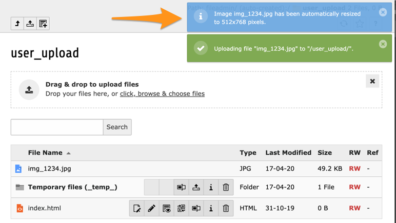
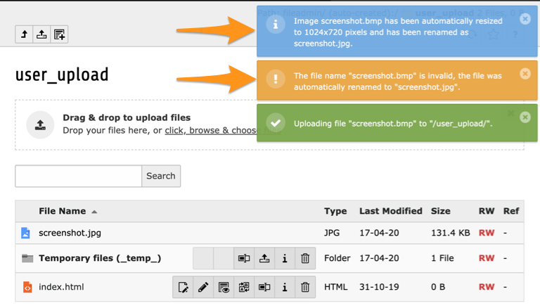
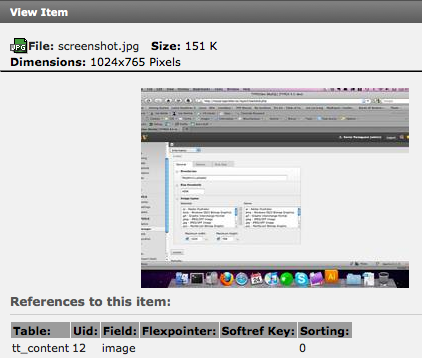

.. ==================================================
.. FOR YOUR INFORMATION
.. --------------------------------------------------
.. -*- coding: utf-8 -*- with BOM.

.. include:: ../Includes.txt

.. _users-manual:

Users Manual
============

This chapter describes how to use the extension from a user point of view.

.. _workflow:

Workflow
--------

Simply upload your unmodified pictures either from the File > Filelist module (fileadmin) or from the edit form of a
content element (text with image, image, ...) and enjoy the automatic resizing and orientation in portrait of your
pictures (here with an original picture in 4080 × 2720, 3.6 MB with EXIF orientation set to "portrait"):

As you see, the constraints of 1024 × 768 pixels have been taken into account even with the correct orientation of the
picture. If the reorientation did not have been taken into account, the picture would have been resized to 682 × 1024
instead (maximum ratio using the other dimension).

Here is another example, from a content element "text w/image" where a BMP (:file:`screenshot.bmp`, 3.2 MB, 1184 × 884)
has been added to the list of associated images:

The uploaded file :file:`screenshot.bmp` has automatically been both resized and converted to a new
file ``screenshot.jpg`` (according to the image type conversion mapping option described in chapter :ref:`admin-manual`).

Details of this image show that its footprint is now quite small (151 KB):

.. note::
	This extension is fully compatible with FAL (File Abstraction Layer) introduced with TYPO3 6.0. When an image is
	resized or converted from one format to another, the corresponding index in FAL (together with associated metadata
	starting from TYPO3 6.2) is updated accordingly.

.. _supported-image-types:

Supported image types
---------------------

This extension performs the resize with the standard image library API from TYPO3 meaning that on a well-configured
system, following formats are supported:

ai
	Adobe Illustrator

bmp
	Windows OS/2 Bitmap Graphics

gif
	Graphic Interchange Format

jpg/jpeg
	JPEG/JIFF Image

pcx
	Paintbrush Bitmap Graphic

png
	Portable Network Graphic

tga
	Truevision Targa Graphic

tif/tiff
	Tagged Image Format
